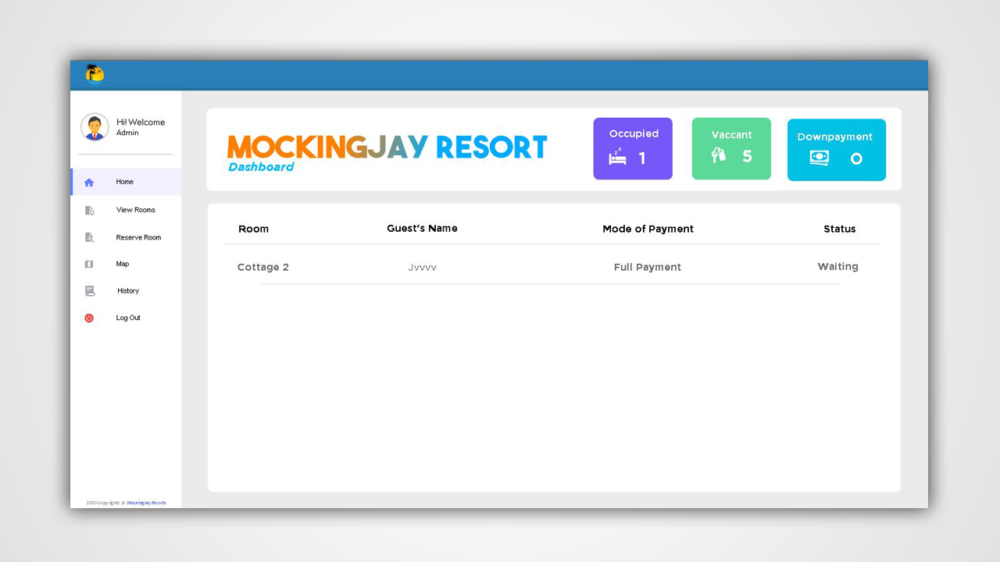
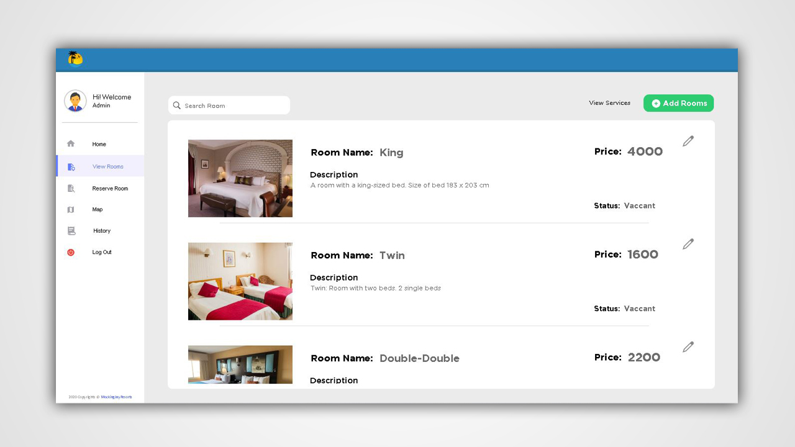
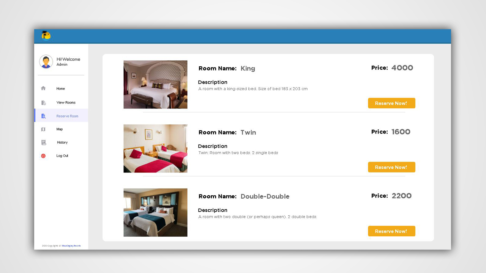
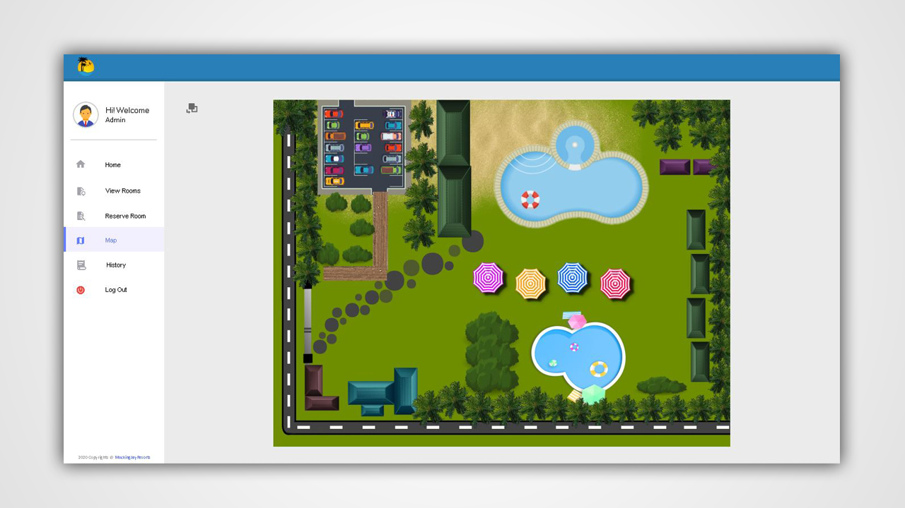
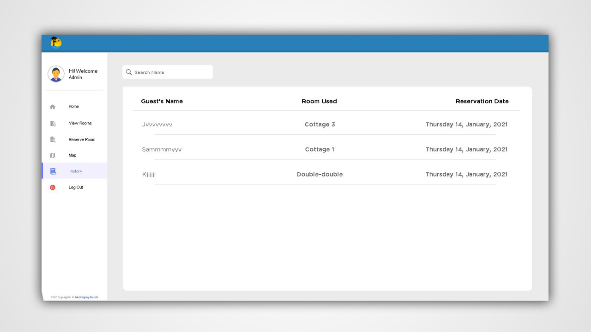
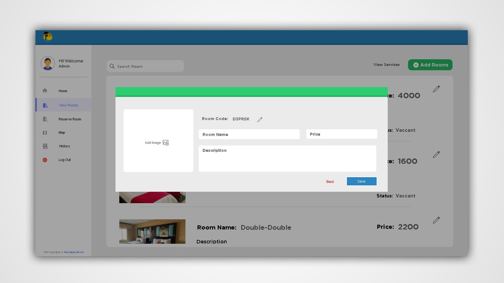
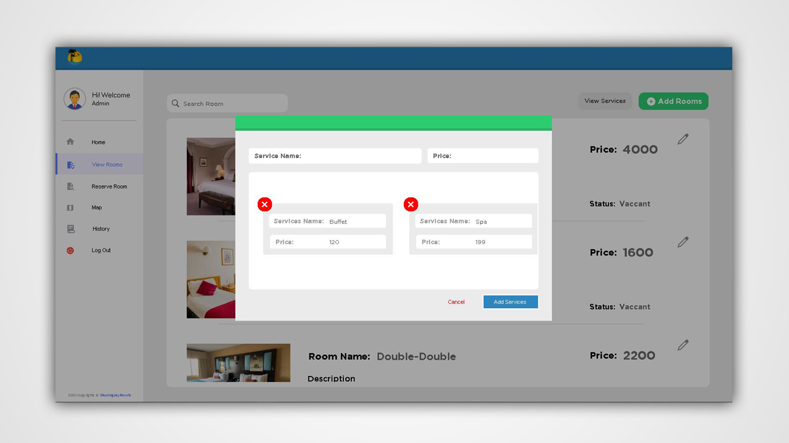
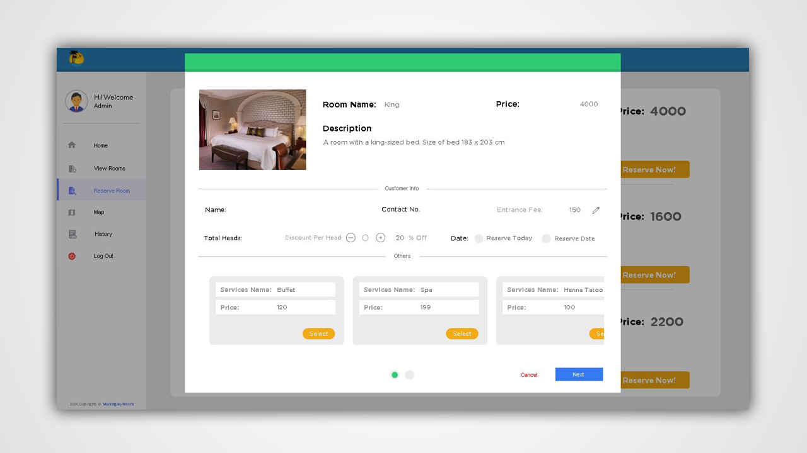
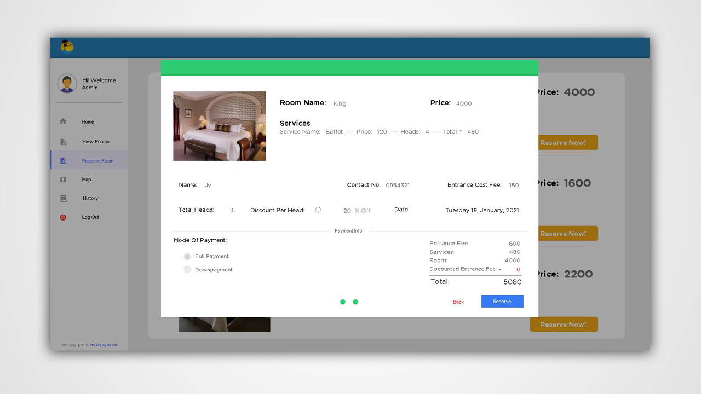
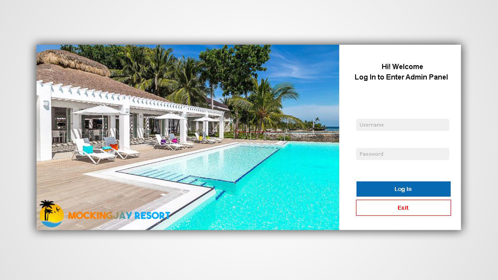

# Mocking Jay Resort Reservation System

Mocking Jay Resort Reservation System enables the costumer to choose and reserve their rooms at the time of reservation or even ahead of time, and even allow customers to select extras such as wine, flowers, fruit or other necessities to be placed in their room at the time of arrival and other offered services like Massage, Spa and etc.

## Contributers
- Jerryl Mae Belic
- Jon Bryan Samson
- Kj Aynera
- Lenard Mangay Ayam

## System Documentation
- [PDF](https://github.com/jvtipaymerantes/Mocking-Jay-Resort-Reservation-System/blob/main/Documentation/MockingJay%20Resort%20Reservation.pdf)
- [PowerPoint](https://github.com/jvtipaymerantes/Mocking-Jay-Resort-Reservation-System/blob/main/Documentation/Offline%20Room%20or%20Cottage%20Reservation%20System%20for%20Mocking%20Jay%20Pool%20Resort.pptx)
- [Proposal](https://github.com/jvtipaymerantes/Mocking-Jay-Resort-Reservation-System/blob/main/Documentation/System%20Proposal.docx) 

## Screen Shots

